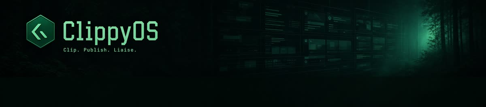
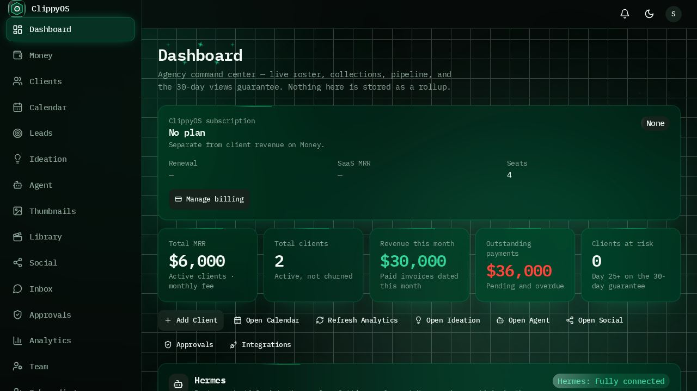
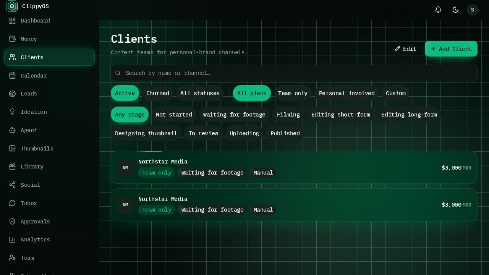
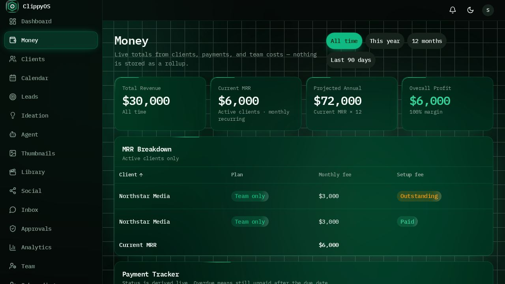
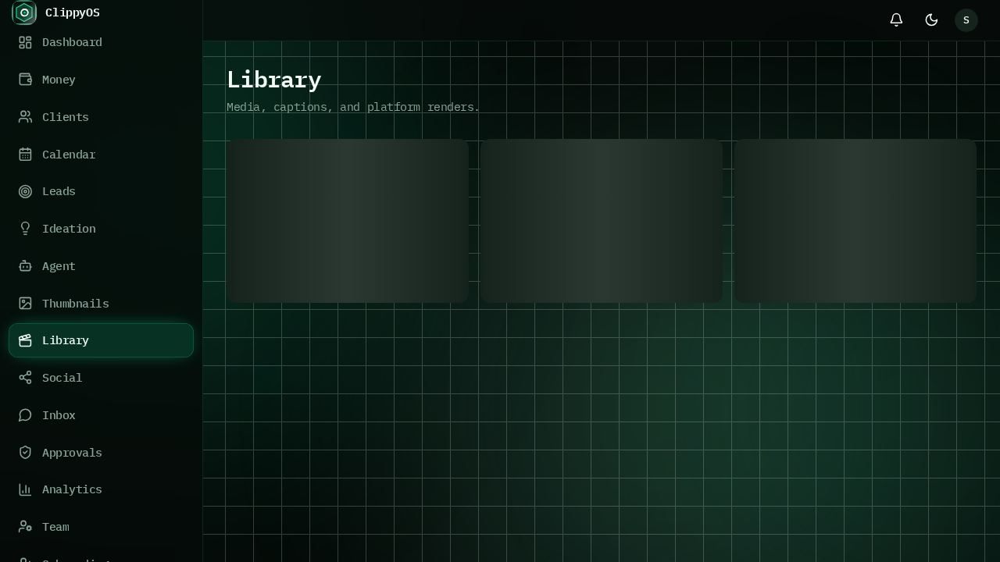

<p align="center">
  
</p>

<h1 align="center">ClippyOS</h1>

<p align="center">
  <strong>The Autonomous Operating System for Clipping.</strong><br/>
  A globally reachable control plane for running a clipping agency — clients,
  money, production, publishing, and a client portal — with an autonomy layer
  that does the busywork under human approval gates.
</p>

<p align="center">
  <a href="https://github.com/swcstudiospace/clippyos/actions/workflows/ci.yml">
    
  </a>
  <a href="LICENSE"></a>
  = 22" />
  
</p>

---

## What ClippyOS is

Clipping agencies run on spreadsheets, DMs, and trust. ClippyOS replaces that
with one operating system: a roster of clients with plans and fees, a live
money view, a content pipeline from ideation to publish, gated automation that
executes the repetitive parts, and a read-mostly portal where clients watch
their own production line.

> **Where's the clipping?** The agency-management OS ships today. The final
> mile — automated clip ingestion, highlight selection, captioning, and
> rendering — is being automated now (see
> [Roadmap](#roadmap)); the rails it will run on (library pipeline, render
> jobs, publisher integrations, approval gates) are already in production in
> this repo.

| | |
|---|---|
|  |  |
|  |  |

## The operator surface

Eighteen screens, one sidebar (`src/lib/nav.ts`). Grouped here by job:

| Job | Screens |
|---|---|
| **Command center** | `/home` dashboard — live roster, collections, pipeline counts, daily objectives; nothing stored as rollups |
| **Revenue & clients** | `/money` live totals · `/clients` roster + per-client detail with AI analysis · `/calendar` collection days · `/leads` prospect pipeline · `/billing` the ClippyOS subscription itself |
| **Production** | `/ideation` AI idea threads tagged to clients · `/agent` clipping-agent runs · `/thumbnails` chat-composed thumbnail sessions with canvas refinement · `/library` clips, thumbs, captions, platform-ready renders |
| **Distribution** | `/social` on-demand posting to Instagram, X, TikTok, YouTube · `/inbox` professional Telegram/WhatsApp liaison · `/approvals` human sign-off before anything goes live |
| **Ops & assurance** | `/health` integration checks (idempotent retries, never auto-starts the Social Machine) · `/analytics` stored performance snapshots · `/team` human workload vs. overload threshold · `/onboarding` bring a channel onto the roster · `/settings` add-ons, Skills, LLM providers, MCP, Hermes Connect |

Plus two audiences beyond the operator:

- **Client portal** (`/portal`) — invite-based login, production-stage
  tracker, day *N* of the 30-day guarantee, deliverable downloads over signed
  URLs, client-side approvals, and a read-only activity timeline. Clients see
  their work, never your fees or tooling.
- **Public site** (`/`) — landing, feature grid, Request-a-Demo flow, and
  Get Access checkout leading into `/login`.

## Architecture

Globally reachable control plane on Vercel; durable state in managed Postgres;
files in object storage; a single Windows machine for platform logins — kept
paused, not destroyed.

| Layer | Where | Role |
|---|---|---|
| App / API / MCP | Vercel (TanStack Start, Nitro `vercel` preset) | Server functions, `/api/v1`, MCP server, OAuth 2.1 |
| Database | Managed Postgres (Supabase / Neon) via `DATABASE_URL`; embedded **PGLite** fallback locally | RLS-enabled schema; migrations apply automatically |
| Clip files | **Supabase Storage** (`clippy-library` bucket) or S3-compatible overflow (Filebase / Storj / R2) | Survives deploys. Never the Windows VM. |
| IPFS | Pinata pin / Filebase CID | Pin layer only — never the write backend |
| Social Machine | Daytona **windows-large** VM (4 vCPU / 16 GiB) | Computer Use only: platform logins, uploads. Pause = pause; hibernate snapshots while running. Never started by cron or Test Connection. |
| Render / sandboxes | Short-lived Linux jobs (`ffmpeg`/`ffprobe`, skill sandboxes) | Isolated from browser profiles |

Key source trees: `src/routes/_app` (operator screens), `src/routes/api`
(HTTP surface), `src/lib/server` (server-only domain logic),
`src/lib/auth` (Better Auth wiring), `migrations/` (SQL, add-only),
`supabase/schema.sql` (consolidated schema), `scripts/` (QA + pipeline).

## Autonomy, safely

The autonomy stack executes real agency actions — and is deliberately
leashed:

- **Playbooks with conservative policies** (`src/lib/playbooks.ts`) —
  auto-mark-payments off, no stage advancement without evidence, social
  uploads default to `draft`, idle-stop timers, bulk-job caps.
- **Human approval gates** — fee changes, churn, hard deletes, integration
  disconnects, bulk mark-paid, large backward stage jumps, Daytona key
  rotation, raw session-material export, and more require sign-off in
  `/approvals`.
- **Scoped API keys** (`src/lib/autonomy.ts`) — twelve coarse scopes
  (`read`, `write:payments`, `approvals:admin`, …) for operators and agents.
- **Audit + idempotency** — every `/api/v1` mutation writes an audit log and
  honors idempotency keys (`src/lib/server/autonomy-audit.server.ts`).
- **Skills with provenance** — SKILL.md packages marked `human`, `agent`, or
  `builtin`; agent-proposed skills enter `pending_review`; sandboxed runtime
  defaults to no network (`src/lib/skills.ts`).

## Integrations & APIs

- **Versioned REST API** — `/api/v1/*` with scoped keys, idempotency, and
  action-level routing (`src/routes/api/v1.$.ts`).
- **Remote MCP server** — expose the OS to coding agents over MCP with a full
  **OAuth 2.1** authorization flow (`src/routes/api/mcp.ts`,
  `src/lib/mcp-oauth.ts`), including protected-resource metadata.
- **Outbound webhooks** — ~40 event types (`payment.collected`,
  `approval.requested`, `social.upload.succeeded`, `agent.run.*`, …) signed
  and delivered to your endpoints.
- **Inbound channels** — Telegram, WhatsApp Cloud API, and Airwallex payment
  webhooks (`src/routes/api/webhooks/`).
- **First-party connectors** — Linear issue sync, Discord agent runs, xAI /
  Grok models, Higgsfield image generation, Resend email, YouTube Data API,
  Twitch, publisher OAuth for Instagram / X / TikTok / YouTube.

## Tech stack

| Concern | Choice |
|---|---|
| Framework | TanStack Start (React 19, file routes, SSR) on Nitro → Vercel |
| UI | Tailwind CSS v4, Radix UI primitives, Recharts, `cmdk` palette, Motion |
| State/data | TanStack Query + Router, Zustand, Zod |
| Auth | Better Auth (Google / X / email-password), portal bearer tokens |
| DB access | Parameterized SQL over `pg` (managed Postgres) or PGLite (WASM) |
| Testing | Node built-in runner for units; Playwright suites (`scripts/qa-*.mjs`) for flows |

## Quickstart

```bash
git clone https://github.com/swcstudiospace/clippyos && cd clippyos
npm install                      # Node 22+
cp .env.example .env             # names only — real values stay out of git
npm run dev                      # http://localhost:8080
```

With no `DATABASE_URL`, the app boots on embedded PGLite and applies
`migrations/*.sql` automatically — same schema, throwaway data. Point
`DATABASE_URL` at any Postgres to go durable; no code changes
(`src/lib/db.ts`).

Full verification matrix:

```bash
npm test            # unit tests (node:test)
npm run typecheck   # tsc --noEmit
npm run lint        # eslint
npm run check:auth  # dev/build agree on VITE_AUTH_ENABLED (needs dev server up)
```

## Configuration

Set in Vercel (or your host) — never commit a `.env`. Names are documented in
[`.env.example`](.env.example):

| Variable | Purpose |
|---|---|
| `DATABASE_URL` | Managed Postgres connection (unset ⇒ local PGLite) |
| `SUPABASE_URL` / `SUPABASE_ANON_KEY` / `SUPABASE_SERVICE_ROLE_KEY` | Supabase Storage for the clip library |
| `BETTER_AUTH_SECRET` | Session signing |
| `CRON_SECRET` | Protects `/api/cron/ops` (every 15 min; sweeps queues, never starts the VM) |
| `LIBRARY_S3_*`, `PINATA_JWT`, `LIBRARY_IPFS_GATEWAY` | Optional S3 overflow + IPFS pin layer |
| `TELEGRAM_BOT_TOKEN`, `WHATSAPP_ACCESS_TOKEN`, `WHATSAPP_PHONE_NUMBER_ID` | Optional liaison channels |
| `XAI_API_KEY`, `RESEND_API_KEY`, `DISCORD_BOT_TOKEN`, `YOUTUBE_API_KEY`, `DAYTONA_API_KEY`, `HIGGSFIELD_*` | Optional provider keys |

Operator-saved credentials (publisher OAuth, Daytona key, proxy, Linear,
Telegram, WhatsApp) live server-side under Settings — never in the browser
bundle and never in env vars.

## Deployment

The repo is production-shaped: no secrets in git, add-only SQL migrations
under `migrations/`, and the Vercel preset wired into Vite. Connect the repo
to a Vercel project; `npm run build` compiles, patches SSR exports, and
applies pending migrations before the deploy goes warm. Liveness:
`GET /api/health`.

## How this repo is engineered

Every change travels the same pipeline — planning before code, review before
hardening, verification before release:

1. **Plan** — contract first: routes, types, and blast radius written down
   before edits (`AGENTS.md` is the operating guide agents and humans share).
2. **Implement** — smallest correct change; server-only boundaries respected;
   add-only migrations.
3. **Review** — diff checked against repo conventions and the PR template
   contracts checklist.
4. **Harden** — threat-model new inputs; secrets scanned; auth invariant
   re-checked (`npm run check:auth`).
5. **Verify** — `npm test`, `npm run typecheck`, `npm run lint` locally and
   in CI; UI changes exercised through the Playwright `qa-*.mjs` suites and
   the dual-viewport `browser-smoke.mjs` verdict.
6. **Release** — conventional commit, deploy on merge, migrations apply in
   the build, rollback = redeploy previous tag.

## Roadmap

- **Automated clipping pipeline** (in progress) — ingestion → highlight
  detection → captioning → render → review queue, riding the existing
  library/publisher/approval rails.
- Deeper analytics pulls and benchmarking across client channels.
- Expanded playbook marketplace built on the Skills provenance system.

## Community

- Bugs and features: open an issue with the templates under
  [.github/ISSUE_TEMPLATE](.github/ISSUE_TEMPLATE).
- Contributions: read [CONTRIBUTING.md](CONTRIBUTING.md) and
  [AGENTS.md](AGENTS.md) first.
- Security: private disclosure only — see [SECURITY.md](SECURITY.md).
- Support: [SUPPORT.md](SUPPORT.md).

## License

[MIT](LICENSE) © SWC Studio.
